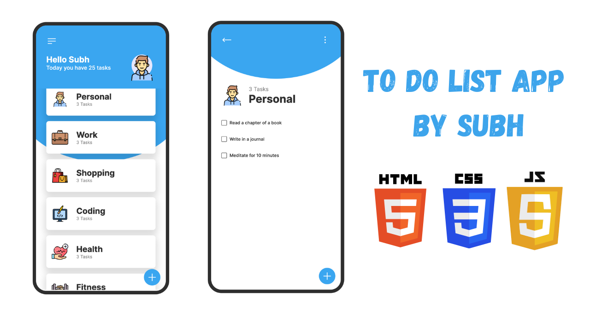

# 📝✨ To-Do List App

Welcome to my sleek and intuitive to-do list app! 🚀

Tired of forgetting important tasks? Say goodbye to scattered notes and hello to organized productivity! This app simplifies task management, allowing you to effortlessly add, edit, and delete tasks with just a few clicks. ✔️💼

## Features

- Add, edit, and delete tasks with ease ✅
- Stay focused and productive 💪
- Sleek and intuitive design for seamless task management 📱💻
- Your ultimate tool for getting things done! 🎯🌟

## Getting Started

1. Clone the repository.
2. Open the app in your preferred code editor.
3. Start organizing your tasks effortlessly!

## Usage

1. Add tasks using the '+' button.
2. Edit or delete tasks as needed.
3. Mark tasks as completed to track your progress.

## Feedback

I'd love to hear your feedback! Let me know how I can improve the app to better suit your needs. Feel free to open an issue or submit a pull request.

## Support

If you encounter any issues or have questions, please reach out to me through my social handels

Start organizing your tasks with ease today! 🚀✨
